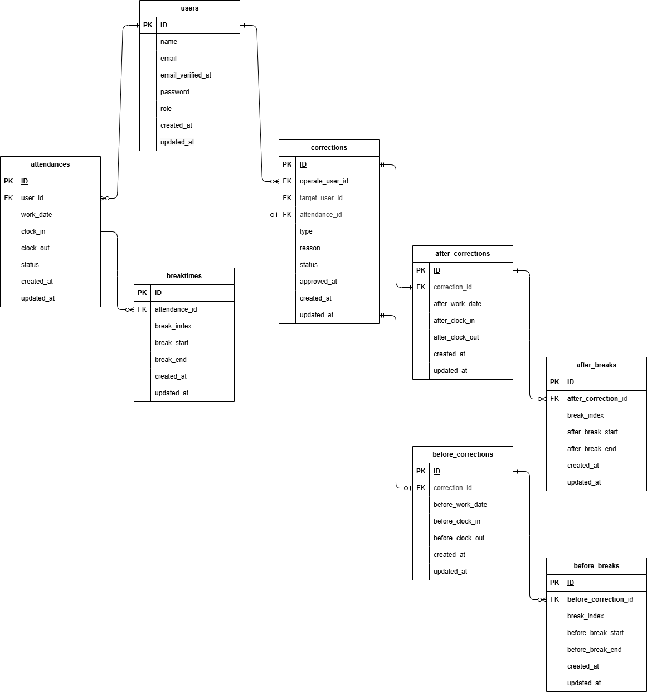

## アプリケーション名

勤怠アプリ

## 環境構築

リポジトリからダウンロード

```
git clone https://github.com/sazenshinji/shigeno-sp2a-kintai.git
```

「.env.example」をコピーして「.env」を作成し DB の設定を変更

```
cp .env.example .env
```

```
DB_CONNECTION=mysql
DB_HOST=mysql
DB_PORT=3306
DB_DATABASE=laravel_db
DB_USERNAME=laravel_user
DB_PASSWORD=laravel_pass
```

docker コンテナを構築

```
docker-compose up -d --build
```

php コンテナにログインして Laravel をインストール

```
docker-compose exec php bash
composer install
```

アプリケーションキーを作成

```
php artisan key:generate
```

DB のテーブルを作成

```
php artisan migrate:fresh
```

DB のテーブルにダミーデータを投入
管理者は以下の内容で、2 名の情報を'users'テーブルに保存します。
name ： '長嶋 茂雄',
email ： '1234@abcd5',
password ： '12345678',

name ： '澤 穂希',
email ： '1234@abcd6',
password ： 12345678',

```
php artisan db:seed
```

"The stream or file could not be opened"エラーが発生した場合
src ディレクトリにある storage ディレクトリに権限を設定

```
chmod -R 777 storage
```

=================================================================================

〇「PHPUnit による単体テスト」について

１．準備

1.1 テスト用のデータベースの準備

・MySQL コンテナに入る。

bash

cd coachtech/shigeno-sp2a-kintai/

docker-compose exec mysql bash

・root ユーザ(管理者)でログイン。

bash

mysql -u root -p

root

・「fleama_test」というデータベースを作成する。

bash

CREATE DATABASE fleama_test;

・mysql、MySQL コンテナから抜ける。

bash

exit

exit

1.2 src/config/database.php ファイルの変更

（★ 編集済のため作業不要です。）

1.3 テスト用の.env ファイル作成

・PHP コンテナにログインし、.env をコピーして.env.testing というファイルを作成

PHP コンテナ

bash

cp .env .env.testing

・PHP コンテナから抜け、コピーしファイルの権限変更

exit

sudo chmod -R 777 *

(パスワードを入力)

・.env.testing ファイルを以下の様に編集する

「文頭部分の APP_ENV と APP_KEY」の変更

---

APP_NAME=Laravel

- APP_ENV=local

- APP_KEY=base64:vPtYQu63T1fmcyeBgEPd0fJ+jvmnzjYMaUf7d5iuB+c=

+ APP_ENV=test

+ APP_KEY=

APP_DEBUG=true

APP_URL=http://localhost

---

「データベースの接続情報」の変更

---

- DB_CONNECTION=mysql

+ DB_CONNECTION=mysql_test

DB_HOST=mysql

DB_PORT=3306

- DB_DATABASE=laravel_db

- DB_USERNAME=laravel_user

- DB_PASSWORD=laravel_pass

+ DB_DATABASE=fleama_test

+ DB_USERNAME=root

+ DB_PASSWORD=root

---

・PHPコンテナに入り、APP_KEY に新たなテスト用のアプリケーションキーを加える

bash

php artisan key:generate --env=testing

1.4 キャッシュの削除とテスト用のテーブルの作成

・キャッシュの削除を行う

bash

php artisan config:clear

・テスト用のテーブルの作成を行う

bash

php artisan migrate --seed --env=testing

1.5 PHPUnit の設定ファイル「phpunit.xml」の編集

（★ 編集済のため作業不要です。）


２．テストの実行

・すべてのテストを実行

bash

php artisan test

・特定のテストを実行

bash

php artisan test --filter=(Feature テストファイル名)

=================================================================================

## 使用技術(実行環境)

PHP 7.4.9 (cli) (built: Sep 1 2020 02:33:08) ( NTS )

Laravel Framework 8.83.8

mysql Ver 8.0.26 for Linux on x86_64 (MySQL Community Server - GPL)

nginx version: nginx/1.21.1

jquery：v3

## URL

開発環境：http://localhost/

phpMyAdmin：http://localhost:8080/

商品一覧画面（トップ画面）：/

商品一覧画面（トップ画面）\_マイリスト：/?tab=mylist

商品一覧画面（トップ画面）\_おすすめ：/?tab=recommend

ログイン画面：/login

会員登録画面：/register

メール認証誘導画面：/email/verify

プロフィール設定画面\_初回ログイン時：/profile/edit

商品詳細画面：/products/{id}

商品購入画面：/products/{id}/purchase

住所変更ページ：/profile/edit-temp?product_id={id}

商品出品画面：/products/create

プロフィール画面：/profile

プロフィール編集画面：/profile/edit?from=profile

プロフィール画面\_購入した商品一覧：/profile?tab=buy

プロフィール画面\_出品した商品一覧：/profile?tab=sell

## ER 図


